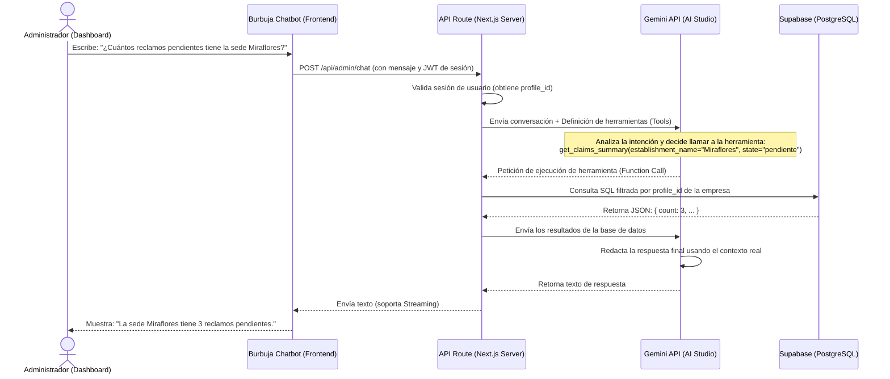

# Guía de Implementación: Asistente IA para Administración de Reclamaciones

Esta guía detalla el diseño, arquitectura y configuración para implementar un **Chatbot Asistente con Inteligencia Artificial** integrado como una burbuja flotante en el panel de administración. Su objetivo es permitir que la empresa consulte en lenguaje natural datos sobre sus reclamos, estadísticas, sedes y categorías de forma interactiva y segura.

---

## 1. Arquitectura del Sistema y Flujo de Datos

El chatbot funcionará bajo el patrón **RAG (Retrieval-Augmented Generation) y Function Calling (Uso de Herramientas)**. Esto garantiza que la IA no invente datos y solo acceda a la información autorizada para la empresa autenticada.



---

## 2. Servicios Externos a Configurar

Para lograr un funcionamiento rápido, robusto y con **costo $0 USD en desarrollo y producción**, configuraremos los siguientes servicios:

### A. Google AI Studio (Gemini API)
Usaremos **Gemini 1.5 Flash** o **Gemini 2.5 Flash** debido a su velocidad, amplio contexto y su excelente nivel gratuito sin tarjeta de crédito.

1. **Creación de API Key**:
   - Ve a [Google AI Studio](https://aistudio.google.com/).
   - Inicia sesión con tu cuenta de Google.
   - Haz clic en **"Get API Key"** y crea una clave para un proyecto nuevo o existente.
2. **Configuración de Variables de Entorno**:
   - Agrega la clave al archivo `.env.local` de tu proyecto:
     ```env
     GEMINI_API_KEY=tu_api_key_aqui
     ```

### B. Supabase (Base de Datos)
No se requieren servicios de bases de datos vectoriales adicionales porque consultaremos directamente los datos relacionales de la empresa (reclamos, categorías, sedes) a través de consultas tradicionales y seguras de PostgreSQL.
- Se debe asegurar que las políticas de RLS (Row Level Security) estén activas. La API de Next.js utilizará el cliente de Supabase del servidor, validando que el `profile_id` de la consulta coincida con el id del usuario logueado en la sesión.

---

## 3. Plan de Implementación paso a paso

### Paso 1: Interfaz de Usuario (Burbuja Flotante)
Crear un componente cliente en React (`components/admin/chat-assistant-bubble.tsx`) que se renderizará en el layout principal del dashboard.

- **Diseño estético premium**:
  - Burbuja circular flotante en la esquina inferior derecha (`fixed bottom-6 right-6`).
  - Animación suave de escala y entrada (`animate-in fade-in slide-in-from-bottom-5`).
  - Panel de chat de estilo minimalista/glassmorphism (`backdrop-blur-md bg-card/95 border border-border/50 shadow-2xl rounded-2xl`).
  - Indicador de carga ("Escribiendo...") con animación de pulso.
- **Funcionalidad**:
  - Mantener un historial de conversación local.
  - Scroll automático hacia el último mensaje.
  - Soporte de renderizado de Markdown simple para las respuestas del bot.

### Paso 2: Endpoint de Orquestación (API Route)
Crear un Route Handler en Next.js (`app/api/admin/chat/route.ts`).

- **Validación de Seguridad**:
  - Validar la sesión con `@/lib/supabase/server`. Si no está autenticado, retornar `401 Unauthorized`.
  - Extraer el `profile_id` del usuario autenticado para asegurar que **todas** las consultas de herramientas estén estrictamente vinculadas a su empresa.
- **Lógica de Gemini**:
  - Instalar el SDK oficial: `npm install @google/generative-ai` (o `@google/genai`).
  - Configurar las herramientas (**Tools**) de Gemini para que pueda mapear la intención del usuario a funciones de servidor.

### Paso 3: Definición de Herramientas (Function Calling)
En lugar de permitir que la IA ejecute SQL arbitrario (lo cual es un riesgo grave de seguridad), definimos funciones predefinidas que ejecutan queries seguras en Supabase usando el cliente de servidor:

1. **`get_claims_summary(filters)`**: Devuelve conteos generales (ej. totales, por estado, por sede).
2. **`get_latest_claims(limit)`**: Trae una lista resumida de los últimos reclamos recibidos.
3. **`get_claim_detail(claim_code)`**: Obtiene todo el detalle de un reclamo específico (motivo, monto, reclamante, estado y respuesta).
4. **`get_establishments()`**: Lista las sedes/establecimientos registrados para la empresa.
5. **`get_categories()`**: Lista las categorías disponibles para clasificar quejas.

*Ejemplo de implementación de una herramienta en el servidor:*
```typescript
async function get_claims_summary(profileId: string, state?: string, establishmentName?: string) {
  const supabase = await createClient();
  let query = supabase
    .from('claims')
    .select('id, state, type_asset, claim_type, establishments!inner(name)', { count: 'exact' })
    .eq('profile_id', profileId);

  if (state) {
    query = query.eq('state', state);
  }
  if (establishmentName) {
    query = query.ilike('establishments.name', `%${establishmentName}%`);
  }

  const { data, count, error } = await query;
  return { count, error };
}
```

### Paso 4: Prompt del Sistema (System Instructions)
Configurar el comportamiento del asistente con las siguientes instrucciones fijas:
- **Rol**: Eres "ClaimsAI", un asistente experto en auditoría y consulta de reclamaciones de la empresa.
- **Acceso**: Solo puedes responder preguntas sobre reclamos, sedes, alertas y categorías utilizando las herramientas provistas.
- **Privacidad**: Nunca reveles información o IDs internos técnicos a menos que sea el código de reclamo solicitado.
- **Restricciones**: Si el usuario te pregunta por temas no relacionados a su empresa, rehusate amablemente e indícale que tu función es asistir únicamente en la administración del Libro de Reclamaciones.

---

## 4. Próximos Pasos para Desarrollo

1. Obtener la **API Key de Gemini** en Google AI Studio y añadirla al `.env.local`.
2. Crear las funciones de consulta segura a la base de datos en una capa de repositorio o servicio.
3. Escribir el Route Handler de Next.js en `app/api/admin/chat/route.ts` que coordine la comunicación con Gemini y las herramientas de Supabase.
4. Diseñar e integrar la burbuja flotante del Chatbot en `components/admin-chat-bubble.tsx` y añadirla a `app/(admin)/dashboard/layout.tsx`.