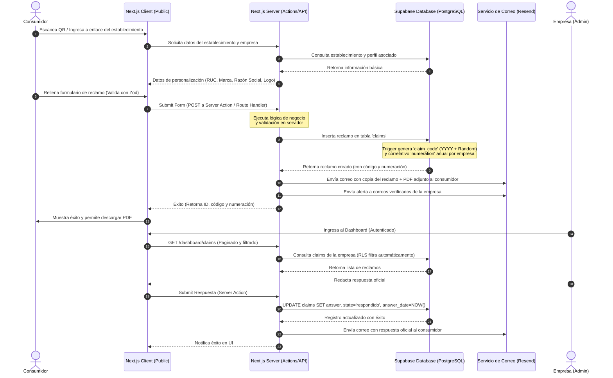
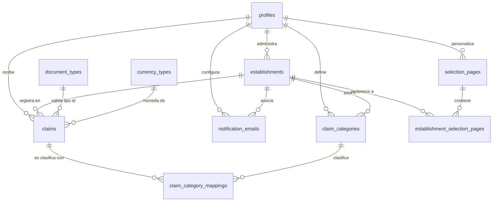

# Especificación Técnica: Sistema de Libro de Reclamaciones Virtual

Este documento describe detalladamente la arquitectura, estructura de datos y especificaciones del sistema de **Libro de Reclamaciones Virtual** (alineado con la normativa de protección al consumidor de INDECOPI en Perú). La solución está adaptada para un stack moderno basado en **Next.js 16 (App Router)**, **shadcn/ui** y **Supabase**, diseñado bajo principios de Clean Architecture para garantizar un producto profesional, mantenible, seguro y escalable ante futuros cambios de infraestructura o backend.

---

## 1. Arquitectura General y Flujo del Sistema

El sistema utiliza una arquitectura híbrida impulsada por **Next.js** y **Supabase**. Las interacciones públicas (registro de reclamos y consultas rápidas) consumen servicios expuestos de forma segura, mientras que la administración interna de las empresas opera detrás de un sistema de autenticación robusto administrado por Supabase Auth y validado por Next.js Middleware.

### Roles del Sistema
*   **Super Administrador (Sistema):** Administra los catálogos globales del sistema (Tipos de documento, Monedas) desde la base de datos o consola administrativa.
*   **Empresa / Proveedor (Usuario Autenticado):** Administra sus datos de perfil (RUC, Razón Social, Logo), configura sus establecimientos físicos o virtuales, define categorías internas para los reclamos, gestiona los correos de notificación de su personal y emite respuestas oficiales a los reclamos recibidos.
*   **Consumidor Reclamante (Público):** Accede al formulario a través de un enlace único o código QR de un establecimiento. Registra su reclamo, descarga el comprobante oficial en formato PDF y consulta el estado del reclamo utilizando un código de seguimiento de 12 dígitos.

### Arquitectura de Flujo de Datos


---

## 2. Abstracción y Escalabilidad (Clean Architecture)

Para asegurar la mantenibilidad a largo plazo y la posibilidad de migrar la base de datos o el backend (por ejemplo, a un backend robusto en Go, NestJS o Laravel) sin reescribir la interfaz de usuario, se implementa el **Repository Pattern** en la capa del servidor de Next.js.

### Directorio de Capas de la Aplicación
```
/src
  /app
    /(admin)           # Rutas del panel de control protegidas
    /(public)          # Rutas públicas (Formulario de libro, consultas)
    /api               # Endpoints REST para integraciones externas
  /components
    /ui                # Componentes shadcn/ui puros
    /forms             # Componentes de formulario reutilizables
    /layout            # Header, Sidebar, Wrapper del dashboard
  /lib
    /core
      /entities        # Definiciones de tipos del dominio
      /repositories    # Interfaces del repositorio (contrato abstracto)
      /services        # Casos de uso de negocio (ej. gestión de reclamos)
    /infrastructure
      /supabase        # Implementación concreta de repositorios usando Supabase
      /email           # Implementación del servicio de correos (Resend)
      /pdf             # Generador de PDF oficial
```

### Ejemplo de Abstracción de Repositorio (`IClaimsRepository`)
Cualquier interacción con la base de datos o API debe realizarse implementando una interfaz de repositorio.

```typescript
// src/lib/core/repositories/claims-repository.interface.ts
import { Claim, ClaimInsertInput, ClaimUpdateInput } from '@/lib/core/entities/claim';

export interface IClaimsRepository {
  getById(id: string): Promise<Claim | null>;
  getByCode(code: string): Promise<Claim | null>;
  listByCompany(profileId: string, filters: { page: number; limit: number; state?: string }): Promise<{ data: Claim[]; count: number }>;
  create(data: ClaimInsertInput): Promise<Claim>;
  update(id: string, data: ClaimUpdateInput): Promise<Claim>;
}
```

La implementación concreta (`SupabaseClaimsRepository`) inyectará el cliente de Supabase. Si en el futuro se migra a otra base de datos o backend, solo se modificará la carpeta `/infrastructure` y el mapeo en los servicios.

---

## 3. Esquema de Base de Datos y RLS (Supabase / PostgreSQL)

De acuerdo con las buenas prácticas de Supabase y Postgres, todos los identificadores de tablas y columnas se definen en **minúsculas y usando snake_case** para evitar problemas de compatibilidad y la necesidad de usar comillas dobles en consultas SQL.



### 3.1 Estructura de Tablas (DDL SQL)

```sql
-- Habilitar extensión UUID
create extension if not exists "uuid-ossp";

-- 1. profiles (Información de la empresa, vinculada a auth.users de Supabase Auth)
create table public.profiles (
  id uuid references auth.users(id) on delete cascade primary key,
  name text not null, -- Nombre del contacto o administrador
  company_ruc varchar(11) not null unique,
  company_name text not null, -- Razón Social
  company_address text not null, -- Dirección Fiscal
  company_postal_code varchar(10),
  company_link text,
  company_logo text, -- URL pública del bucket de Supabase Storage
  role text not null default 'owner' check (role in ('super_admin', 'owner', 'admin', 'manager')),
  created_at timestamp with time zone default timezone('utc'::text, now()) not null,
  updated_at timestamp with time zone default timezone('utc'::text, now()) not null
);

-- 2. establishments (Locales comerciales físicos o virtuales)
create table public.establishments (
  id uuid default gen_random_uuid() primary key,
  profile_id uuid references public.profiles(id) on delete cascade not null,
  name text not null, -- e.g., "Sede Miraflores" o "E-commerce Principal"
  custom_link text not null, -- Slug para acceso directo (e.g., "miraflores-digital")
  type_address varchar(10) not null check (type_address in ('Fisico', 'Virtual')),
  code varchar(50), -- Código interno asignado por Sunat/empresa
  address text, -- Requerido si es físico
  department text,
  province text,
  district text,
  zip_code varchar(10),
  web_page text, -- Requerido si es virtual
  created_at timestamp with time zone default timezone('utc'::text, now()) not null,
  updated_at timestamp with time zone default timezone('utc'::text, now()) not null,
  
  constraint unique_custom_link_per_profile unique(profile_id, custom_link)
);

-- 3. claim_categories (Clasificación de reclamos definida por la empresa)
create table public.claim_categories (
  id uuid default gen_random_uuid() primary key,
  profile_id uuid references public.profiles(id) on delete cascade not null,
  establishment_id uuid references public.establishments(id) on delete set null,
  name text not null, -- e.g., "Atención al Cliente", "Delivery"
  created_at timestamp with time zone default timezone('utc'::text, now()) not null
);

-- 4. selection_pages (Páginas multi-establecimiento)
create table public.selection_pages (
  id uuid default gen_random_uuid() primary key,
  profile_id uuid references public.profiles(id) on delete cascade not null,
  custom_link text not null unique, -- Slug único para la landing (e.g., "grupo-nona")
  brand_name text,
  logo_url text,
  created_at timestamp with time zone default timezone('utc'::text, now()) not null,
  updated_at timestamp with time zone default timezone('utc'::text, now()) not null
);

-- 5. establishment_selection_pages (Pivot Many-to-Many)
create table public.establishment_selection_pages (
  id uuid default gen_random_uuid() primary key,
  selection_page_id uuid references public.selection_pages(id) on delete cascade not null,
  establishment_id uuid references public.establishments(id) on delete cascade not null,
  created_at timestamp with time zone default timezone('utc'::text, now()) not null,
  
  constraint unique_establishment_per_page unique(selection_page_id, establishment_id)
);

-- 6. notification_emails (Emails donde se envían alertas de reclamos entrantes)
create table public.notification_emails (
  id uuid default gen_random_uuid() primary key,
  profile_id uuid references public.profiles(id) on delete cascade not null,
  establishment_id uuid references public.establishments(id) on delete cascade not null,
  email text not null,
  verified boolean default false not null,
  verification_token text,
  created_at timestamp with time zone default timezone('utc'::text, now()) not null,
  
  constraint unique_email_per_establishment unique(establishment_id, email)
);

-- 7. document_types (Catálogo estático de documentos de identidad)
create table public.document_types (
  id serial primary key,
  abbreviation varchar(10) not null unique, -- e.g., "DNI", "CE", "RUC", "Pasaporte"
  character_count integer default 12 not null,
  name text not null,
  is_active boolean default true not null
);

-- 8. currency_types (Catálogo estático de monedas)
create table public.currency_types (
  id serial primary key,
  abbreviation varchar(10) not null unique, -- e.g., "PEN", "USD"
  name text not null,
  symbol varchar(5) not null,
  is_active boolean default true not null
);

-- 9. claims (El reclamo o queja)
create table public.claims (
  id uuid default gen_random_uuid() primary key,
  profile_id uuid references public.profiles(id) on delete cascade not null,
  establishment_id uuid references public.establishments(id) on delete cascade not null,
  
  -- Datos del Reclamante
  name text not null,
  under_age boolean default false not null,
  parent_name text, -- Obligatorio si under_age = true
  document_type_id integer references public.document_types(id) not null,
  document_number varchar(30) not null,
  email text not null,
  phone varchar(20) not null,
  
  -- Datos del Bien Contratado
  type_asset varchar(10) not null check (type_asset in ('Producto', 'Servicio')),
  description_asset text not null,
  currency_type_id integer references public.currency_types(id),
  claim_amount decimal(12, 2), -- Corregido de claim_mount
  
  -- Detalle del Reclamo
  claim_type varchar(10) not null check (claim_type in ('queja', 'reclamo')),
  claim_text text not null,
  request_text text not null,
  
  -- Campos autogenerados y de control
  numeration bigint, -- Correlativo anual por profile_id
  claim_code varchar(20) unique, -- YYYY-RANDOM (e.g. 2026-B3X9PL7K)
  state varchar(15) default 'pendiente' not null check (state in ('pendiente', 'respondido')),
  
  -- Gestión de respuesta
  answer text,
  answer_date timestamp with time zone,
  email_contact_date timestamp with time zone,
  phone_contact_date timestamp with time zone,
  internal_notes text,
  
  created_at timestamp with time zone default timezone('utc'::text, now()) not null,
  updated_at timestamp with time zone default timezone('utc'::text, now()) not null
);

-- 10. claim_category_mappings (Pivot de clasificación interna de reclamos)
create table public.claim_category_mappings (
  id uuid default gen_random_uuid() primary key,
  claim_id uuid references public.claims(id) on delete cascade not null,
  category_id uuid references public.claim_categories(id) on delete cascade not null,
  created_at timestamp with time zone default timezone('utc'::text, now()) not null
);
```

### 3.2 Índices Críticos para Rendimiento
De acuerdo con las guías de optimización de Supabase, se indexan las llaves foráneas y campos que frecuentemente participan en filtros de búsqueda y políticas RLS.

```sql
create index idx_profiles_ruc on public.profiles(company_ruc);
create index idx_establishments_profile_id on public.establishments(profile_id);
create index idx_establishments_custom_link on public.establishments(custom_link);
create index idx_claims_profile_id on public.claims(profile_id);
create index idx_claims_claim_code on public.claims(claim_code);
create index idx_claims_created_at on public.claims(created_at desc);
create index idx_notification_emails_establishment on public.notification_emails(establishment_id);
```

### 3.3 Políticas de Seguridad a Nivel de Fila (RLS)
Para garantizar la privacidad de los datos sensibles y el aislamiento de las empresas, se habilita RLS en todas las tablas expuestas en el esquema público de Supabase. Conforme a las recomendaciones de rendimiento, las llamadas a funciones de autenticación se envuelven en subconsultas `SELECT` para habilitar el caché de la base de datos.

```sql
-- Habilitar RLS globalmente
alter table public.profiles enable row level security;
alter table public.establishments enable row level security;
alter table public.claim_categories enable row level security;
alter table public.selection_pages enable row level security;
alter table public.establishment_selection_pages enable row level security;
alter table public.notification_emails enable row level security;
alter table public.claims enable row level security;

-- 1. Políticas para profiles
create policy "Permitir lectura del propio perfil" on public.profiles
  for select to authenticated using ((select auth.uid()) = id);

create policy "Permitir actualización del propio perfil" on public.profiles
  for update to authenticated using ((select auth.uid()) = id) with check ((select auth.uid()) = id);

-- 2. Políticas para establishments
create policy "Lectura pública de establecimientos" on public.establishments
  for select to anon, authenticated using (true);

create policy "Gestión total de establecimientos por el dueño" on public.establishments
  for all to authenticated using ((select auth.uid()) = profile_id) with check ((select auth.uid()) = profile_id);

-- 3. Políticas para claims
create policy "Lectura de reclamos para la empresa correspondiente" on public.claims
  for select to authenticated using ((select auth.uid()) = profile_id);

create policy "Inserción pública de reclamos (consumidor)" on public.claims
  for insert to anon, authenticated with check (true);

create policy "Gestión/Respuesta de reclamos para la empresa" on public.claims
  for update to authenticated using ((select auth.uid()) = profile_id) with check ((select auth.uid()) = profile_id);
```

> [!WARNING]
> **Seguridad en la búsqueda de reclamos por el consumidor:**
> No se permite la lectura pública directa de la tabla `claims` a través del cliente API REST (`anon`) sin filtros. Para evitar fugas de información, la búsqueda de un reclamo por parte del reclamante (`GET /claim/[code]`) se procesa en el servidor de Next.js. El servidor realiza la consulta con el cliente administrativo (`service_role` de Supabase o bypass de RLS controlado), pero filtra y limpia la respuesta retornando exclusivamente campos públicos (nombre censurado, tipo de bien, estado del reclamo, fecha y respuesta oficial), excluyendo teléfonos, correos y el número de documento del reclamante.

---

## 4. Autenticación y Manejo de Roles y Permisos

Supabase Auth gestiona el login, registro y la expiración automática de los tokens (JWT). Next.js actúa como la capa de control de acceso a rutas.

### 4.1 Creación de Perfil Automática (Trigger PostgreSQL)
Para evitar que un usuario exista en `auth.users` pero no tenga un registro correspondiente en `public.profiles`, creamos una función disparadora ejecutada en el esquema de autenticación.

```sql
create or replace function public.handle_new_user()
returns trigger
language plpgsql
security definer set search_path = ''
as $$
begin
  insert into public.profiles (id, name, company_ruc, company_name, company_address, role)
  values (
    new.id,
    coalesce(new.raw_user_meta_data->>'name', 'Administrador'),
    coalesce(new.raw_user_meta_data->>'company_ruc', '00000000000'),
    coalesce(new.raw_user_meta_data->>'company_name', 'Mi Empresa S.A.C.'),
    coalesce(new.raw_user_meta_data->>'company_address', 'Dirección Provisional'),
    'owner'
  );
  return new;
end;
$$;

create or replace trigger on_auth_user_created
  after insert on auth.users
  for each row execute procedure public.handle_new_user();
```

### 4.2 Middleware de Next.js para Protección de Rutas
El archivo `middleware.ts` en la raíz del proyecto intercepta cada petición a la sección administrativa `/dashboard/*`, actualizando la sesión activa en las cookies y redirigiendo al usuario al `/login` si su sesión es inválida o ha expirado.

```typescript
// src/middleware.ts
import { createServerClient } from '@supabase/ssr';
import { NextResponse, type NextRequest } from 'next/server';

export async function middleware(request: NextRequest) {
  let response = NextResponse.next({
    request: {
      headers: request.headers,
    },
  });

  const supabase = createServerClient(
    process.env.NEXT_PUBLIC_SUPABASE_URL!,
    process.env.NEXT_PUBLIC_SUPABASE_ANON_KEY!,
    {
      cookies: {
        getAll() {
          return request.cookies.getAll();
        },
        setAll(cookiesToSet) {
          cookiesToSet.forEach(({ name, value, options }) => request.cookies.set(name, value));
          response = NextResponse.next({
            request,
          });
          cookiesToSet.forEach(({ name, value, options }) => response.cookies.set(name, value, options));
        },
      },
    }
  );

  const { data: { user } } = await supabase.auth.getUser();

  // Proteger rutas del dashboard
  if (request.nextUrl.pathname.startsWith('/dashboard') && !user) {
    return NextResponse.redirect(new URL('/login', request.url));
  }

  // Redirigir si ya está autenticado e intenta ir a login/registro
  if ((request.nextUrl.pathname.startsWith('/login') || request.nextUrl.pathname.startsWith('/register')) && user) {
    return NextResponse.redirect(new URL('/dashboard', request.url));
  }

  return response;
}

export const config = {
  matcher: ['/dashboard/:path*', '/login', '/register'],
};
```

---

## 5. Lógica de Negocio Crítica (Triggers de Base de Datos)

Para evitar colisiones en entornos de alta concurrencia y asegurar que las reglas del correlativo de reclamos sean inviolables, delegamos el cálculo de la numeración anual y el código único de seguimiento directamente a PostgreSQL mediante triggers del sistema.

### 5.1 Función y Trigger de Inicialización de Reclamos
Este trigger se ejecuta `BEFORE INSERT ON public.claims` y realiza dos tareas críticas:
1.  **Código Único:** Genera un código de seguimiento con formato `[AÑO]-[8 CARACTERES ALFANUMÉRICOS ALEATORIOS EN MAYÚSCULAS]`. Si el código generado ya existe por colisión, realiza reintentos de forma automática.
2.  **Numeración Anual:** Calcula de forma atómica la numeración incremental correspondiente a la empresa (`profile_id`) durante el año calendario actual.

```sql
create or replace function public.process_claim_before_insert()
returns trigger
language plpgsql
security definer set search_path = ''
as $$
declare
  current_year text;
  random_code text;
  max_num bigint;
  done boolean := false;
begin
  -- 1. Obtener el año actual
  current_year := to_char(now(), 'YYYY');
  
  -- 2. Generar código único aleatorio YYYY-XXXXXXXX
  while not done loop
    random_code := current_year || '-' || upper(substring(md5(random()::text) from 1 for 8));
    -- Verificar si existe colisión
    exists (
      select 1 from public.claims 
      where claim_code = random_code
    ) into done;
    done := not done; -- Si existe, continuar ciclo. Si no existe, finaliza.
  end loop;
  
  new.claim_code := random_code;
  
  -- 3. Calcular correlativo anual de reclamos para la empresa (profile_id)
  select coalesce(max(numeration), 0)
  into max_num
  from public.claims
  where profile_id = new.profile_id
    and extract(year from created_at) = extract(year from now());
    
  new.numeration := max_num + 1;
  
  return new;
end;
$$;

create or replace trigger trg_claims_before_insert
  before insert on public.claims
  for each row execute procedure public.process_claim_before_insert();
```

---

## 6. Endpoints de API y Server Actions

El sistema utilizará Next.js Server Actions para el manejo de formularios interactivos y el flujo interno del dashboard, y expondrá Route Handlers (endpoints REST) en `/app/api/*` en formato JSON para el registro e integraciones del formulario de libro de reclamaciones.

### 6.1 Server Actions (Ejemplo de Firma y Respuesta del Administrador)
Los Server Actions se ejecutan en el servidor, protegiendo las credenciales y el bypass controlado de privilegios.

```typescript
// src/app/(admin)/dashboard/claims/actions.ts
'use client'; // Nota: En desarrollo real se crea en archivo de servidor 'use server'

import { createClient } from '@/lib/supabase/server';
import { revalidatePath } from 'next/cache';

export async function responderReclamo(claimId: string, respuesta: string, notasInternas?: string) {
  const supabase = await createClient();
  
  // Validar sesión activa en el servidor
  const { data: { user }, error: authError } = await supabase.auth.getUser();
  if (authError || !user) {
    throw new Error('No autorizado');
  }

  // Actualizar el reclamo asegurando pertenencia a la empresa vía políticas RLS
  const { data, error } = await supabase
    .from('claims')
    .update({
      answer: respuesta,
      internal_notes: notasInternas,
      state: 'respondido',
      answer_date: new Date().toISOString()
    })
    .eq('id', claimId)
    .eq('profile_id', user.id) // Seguridad extra redundante
    .select()
    .single();

  if (error) {
    return { success: false, error: error.message };
  }

  // Disparar envío de correo asíncrono con la respuesta oficial
  // await sendEmailWithResponse(data.email, data.claim_code, respuesta);

  revalidatePath('/dashboard/claims');
  return { success: true, data };
}
```

### 6.2 Route Handler Público (`POST /api/claims`)
Endpoint público para que las empresas puedan integrar sus propios formularios web con nuestra base de datos.

*   **POST `/api/claims`**
*   **Encabezados Requeridos:** `Content-Type: application/json`
*   **Body de la petición:**
    ```json
    {
      "profile_id": "8ca0e8b1-3e4b-4a5f-9dc1-2bb4c87c9c01",
      "establishment_id": "c1a0e8b1-3e4b-4a5f-9dc1-2bb4c87c9c02",
      "name": "María Alejandra Torres",
      "under_age": false,
      "document_type_id": 1,
      "document_number": "70894512",
      "email": "maria@correo.com",
      "phone": "987654321",
      "type_asset": "Producto",
      "description_asset": "Calzado deportivo talla 38",
      "currency_type_id": 1,
      "claim_amount": 189.90,
      "claim_type": "reclamo",
      "claim_text": "El calzado llegó con fallas en la costura del talón.",
      "request_text": "Quiero el cambio del producto por el mismo modelo sin fallas."
    }
    ```
*   **Respuesta Exitosa (201 Created):**
    ```json
    {
      "success": true,
      "message": "Reclamo registrado exitosamente en el Libro de Reclamaciones",
      "data": {
        "id": "e4a5d8b2-3e4b-4a5f-9dc1-2bb4c87c9c03",
        "claim_code": "2026-F9X2HA81",
        "numeration": 154,
        "state": "pendiente",
        "created_at": "2026-06-23T18:40:00Z"
      }
    }
    ```

---

## 7. Flujos Auxiliares (Correos, PDFs y QRs)

### 7.1 Envío de Alertas y Verificación de Correos
*   **Servicio:** Se utilizará **Resend** en conjunto con **React Email** para plantillas dinámicas y profesionales de correo.
*   **Verificación de Emails de Alerta de Empresa:**
    1. La empresa registra un email para un establecimiento (`notification_emails`).
    2. El sistema guarda un `verification_token` aleatorio (UUID) y marca `verified = false`.
    3. Se despacha un correo a la dirección provista con un enlace apuntando a:
       `https://dominio.com/api/verify-email?token=[TOKEN]`.
    4. Al acceder, un Route Handler valida el token y actualiza la fila a `verified = true`.
*   **Plantilla de Alerta de Reclamo (Empresa):** Cuando ingresa un reclamo, un job asíncrono busca todos los emails verificados del establecimiento y les notifica el correlativo, tipo de bien y un botón de acceso rápido al panel de administración.

### 7.2 Descarga y Generación de PDF (Garantía de Impresión)
El PDF de la "Hoja de Reclamación" debe simular la hoja autocopiativa oficial requerida por ley.
*   Se implementarán dos enfoques complementarios:
    *   **Impresión Nativa (CSS `@media print`):** Plantilla HTML limpia renderizada en una ruta `/claim/print/[code]` oculta. Al hacer clic en "Descargar PDF", se dispara `window.print()` estilizado en formato carta/A4 de página única, forzando la visualización del logotipo, marcas de agua, firmas y los términos de tratamiento de datos.
    *   **Generador Servidor (Opcional - Escalable):** Uso de la biblioteca `@react-pdf/renderer` para generar el documento binario directamente en un Route Handler `/api/claims/[code]/pdf`, útil para adjuntar el archivo directamente en el correo de confirmación enviado al reclamante.

### 7.3 Generación del Cartel Oficial e Impresión de Códigos QR
*   El administrador puede descargar una plantilla en PDF de tamaño A4 o A3 oficial de INDECOPI ("Cartel Informativo del Libro de Reclamaciones").
*   En Next.js, se generará dinámicamente el cartel integrando los datos de la empresa, y el código QR renderizado con la ruta del formulario del local mediante `@react-pdf/renderer`:
    `https://dominio.com/reclamo-virtual/[profile_id]/[establishment_slug]`

---

## 8. Diseño y Reglas del Frontend (shadcn/ui & Tailwind)

Para garantizar un acabado visual premium y moderno, la interfaz se construirá con **Tailwind CSS v4** y componentes de **shadcn/ui** bajo la guía de estilo `radix-mira`.

### 8.1 Reglas del Formulario de Reclamos (`claim-form.tsx`)
El formulario se implementa usando `@hookform/resolvers` y `zod` para las validaciones cruzadas obligatorias.

*   **Composición de Formularios (Regla Estricta de shadcn/ui):**
    No se deben usar contenedores `div` planos o utilidades `space-y-*` en layouts de formulario. Se debe componer estructuralmente utilizando los componentes de formulario oficiales:
    ```tsx
    import { FieldGroup, Field, FieldLabel, FieldDescription } from "@/components/ui/field";
    import { Input } from "@/components/ui/input";
    
    // Correcto:
    <FieldGroup>
      <Field data-invalid={!!errors.name}>
        <FieldLabel htmlFor="name">Nombre Completo</FieldLabel>
        <Input id="name" aria-invalid={!!errors.name} {...register("name")} />
        {errors.name && <FieldDescription>{errors.name.message}</FieldDescription>}
      </Field>
    </FieldGroup>
    ```

*   **Validaciones Condicionales (Zod Refinement):**
    ```typescript
    const claimFormSchema = z.object({
      name: z.string().min(3, "El nombre debe tener al menos 3 caracteres"),
      under_age: z.boolean().default(false),
      parent_name: z.string().optional(),
      document_type_id: z.string(),
      document_number: z.string(),
      has_amount: z.boolean().default(false),
      currency_type_id: z.string().optional(),
      claim_amount: z.coerce.number().optional(),
      claim_type: z.enum(["queja", "reclamo"]),
      claim_text: z.string().min(10, "El detalle debe tener al menos 10 caracteres"),
      request_text: z.string().min(5, "Indique su pedido concreto"),
      terms_consent: z.boolean().refine(val => val === true, "Debe aceptar los términos de uso de datos")
    }).superRefine((data, ctx) => {
      // 1. Validar nombre de tutor legal para menores de edad
      if (data.under_age && (!data.parent_name || data.parent_name.trim().length === 0)) {
        ctx.addIssue({
          code: z.ZodIssueCode.custom,
          path: ["parent_name"],
          message: "El nombre del padre o tutor legal es obligatorio para menores de edad"
        });
      }
      
      // 2. Validar monto y moneda si has_amount es afirmativo
      if (data.has_amount) {
        if (!data.currency_type_id) {
          ctx.addIssue({
            code: z.ZodIssueCode.custom,
            path: ["currency_type_id"],
            message: "Seleccione el tipo de moneda"
          });
        }
        if (!data.claim_amount || data.claim_amount <= 0) {
          ctx.addIssue({
            code: z.ZodIssueCode.custom,
            path: ["claim_amount"],
            message: "El monto reclamado debe ser mayor a 0"
          });
        }
      }
    });
    ```

*   **Cambio Dinámico de Longitud de Documento:**
    Al seleccionar el Tipo de Documento, un efecto en React consulta el catálogo del API de tipos de documento y actualiza la longitud máxima de caracteres permitida (`maxLength`) en el control del número de documento. Por ejemplo:
    *   **DNI:** `maxLength={8}`, solo números.
    *   **RUC:** `maxLength={11}`, solo números.
    *   **Carnet de Extranjería (CE) / Pasaporte:** `maxLength={15}`, alfanumérico.

---

## 9. Seguridad y Buenas Prácticas

1.  **Protección contra IDOR (Insecure Direct Object Reference):**
    En las consultas administrativas en Next.js, nunca se confía en el `profile_id` provisto por el cliente frontend. En su lugar, el servidor obtiene el identificador de usuario verificado (`user.id`) directamente a partir de la firma del token JWT en el cliente Supabase de servidor (`supabase.auth.getUser()`).
2.  **Sanitización de Datos:**
    Toda entrada de texto enriquecido o áreas de texto en el formulario y la respuesta al reclamo se limpian en el backend para mitigar ataques XSS.
3.  **Monitoreo y Auditorías:**
    La base de datos registra de forma inmutable la fecha de creación y actualización de los reclamos. El campo `state` cambia a `respondido` y bloquea cualquier actualización posterior sobre la respuesta enviada para asegurar transparencia en auditorías de protección al consumidor.
4.  **Carga Asíncrona (Performance):**
    El listado de reclamos del panel administrativo utiliza paginación por cursor o por páginas en el servidor de Postgres, evitando payload pesados en el cliente.
